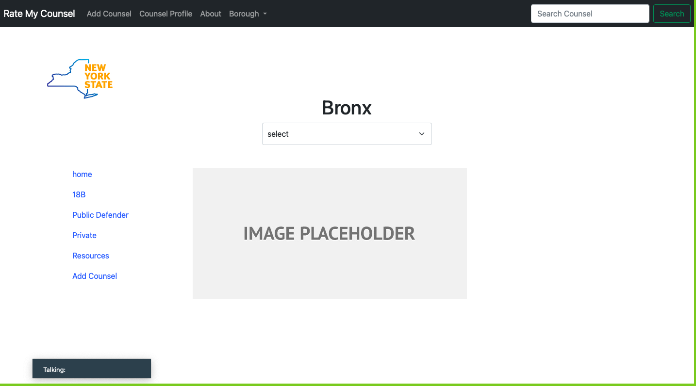

# Rate My Counsel
*Wow Project*
 

### Group Members 
**James Currie** Github Username `curriejames` 

**Oma Strachan** Github Username
`stradroma` 

**Paola Fernandez** Github Username `paolafern611`
 
 
*CREATE & RUN VIRTUAL ENVIRONMENT* 
- from your django-projects folder
run `python3 -m venv django-env` to create a new virtual environment 
- then run `source django-env/bin/activate` on Unix/MacOS or `django-env\Scripts\activate.bat` on Windows to activate the virtual environment 
- you can run `django-env\Scripts\activate.ps1` too if `.bat`  doesn't work
 
 

*INSTALL PROJECT DEPENDENCIES WITH PIP* 
- run `pip install insertpackagehere` to install 
- run `pip freeze > requirements.txt` to install the dependencies of the package
 
 

*RUN DJANGO APPLICATION* 
- use need the `manage.py` file to run the application aka server.
- run `python manage.py runserver`
- Go to local host `http://localhost:8000`
 
 

- This is the home page.
 
 

- This is where you search for the counsel you are looking for.
 
 

- This is the counsel Profile.
 
 

- This is about what this app does and how to use it.
 
 

- This is one of the five borough pages.